# img2min
Image to Mindustry Logic Display converter

## Overview

This program takes an image and generates a program that can be run in a [Mindustry](https://mindustrygame.github.io/) [Logic Processor](https://mindustrygame.github.io/wiki/blocks/233-logic-processor/) to recreate the image in game on a [Logic Display](https://mindustrygame.github.io/wiki/blocks/237-logic-display/).

It's an interesting problem because of the limitations of the "processors" in the game.

* The smallest "micro processor" only runs 120 operations per second
* All processors are limited to 1000 instructions

The approach I took is to find a sequence of solid colored rectangles that will approximate the original image. I start with large rectangles and draw smaller ones on top. How many of each size are parameters, with the defaults being values I've found to work pretty well for my tests.

Mindustry supports multiple processors drawing to the same display, but I opted to solve it for a single processor. This makes it much easier to set up in game and it's a more fun problem :)

## Algorithm

### Implementation

The current algorithm is a greedy, brute-force search for the square to draw that will bring the average difference between what's been drawn to the ground truth. The size of the squares is determined by a power function, meaning that there will be fewer large squares and more smaller ones.

### Possible Improvements

* Pre-process image to determine where detail should be added
  * Doing this step first would allow better decisions for the earlier, larger shapes. If we know that a small section will be covered later, those pixels shouldn't influence the size and color chosen by lower layers
* Use more shapes besides squares
  * Drawing rectangles, triangles, lines, and polygons are supported and could be leveraged to yield better results
* Leverage alpha channel
  * It's conceivable that drawing shapes with transparency could yield better results
* Make smarter decisions about what color to draw
  * At every level, the average color of an area is used for drawing a shape. That's a very greedy approach and doesn't take into account that shapes in the future will be drawn. It's especially bad for very high-contrast images where the average of the image at a large scale is actually pretty far off from what the image looks like at a smaller scale.
* Combine Draw Rect calls of the same, or similar, color
  * Each draw is actually two instructions, one to set the color and one to draw the shape. There may be some instruction count savings in merging shape draw calls that use the same color. I'm not convinced this would yield big gains.

## Examples

The source images are on the left, the middle image are what would be generated on the "Large Logic Display", and the right is what would be shown on the smaller "Logic Display".

Artifacts are more pronounced in the larger images and are especially noticeable in high frequency images, such as the baboon.

| Source Image                                 | Large Logic Display                                          | (small) Logic Display                                        |
| -------------------------------------------- | ------------------------------------------------------------ | ------------------------------------------------------------ |
| 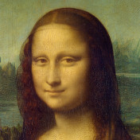 | [mona_lisa_176x176](docs/mona_lisa_176x176.txt) 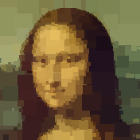 | [mona_lisa_80x80](docs/mona_lisa_80x80.txt) 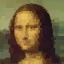 |
| 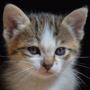       | [kitten_176x176](docs/kitten_176x176.txt) 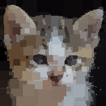 | [kitten_80x80](docs/kitten_80x80.txt) 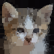 |
| 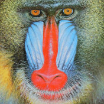       | [baboon_176x176](docs/baboon_176x176.txt) 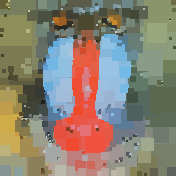 | [baboon_80x80](docs/baboon_80x80.txt) 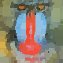 |
| 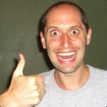             | [pete_176x176](docs/pete_176x176.txt) 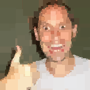 | [pete_80x80](docs/pete_80x80.txt)  |

## Usage

Run `img2min.py`

Requires Python 3 and the "pillow" image library

